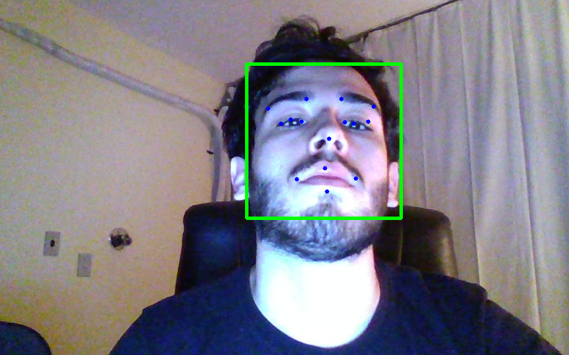

# key-face

Detects facial keypoints using images from camera.

## Overview

There are 2 parts.

1. **Face Detection** - Used Viola-jones with Template Matching
2. **Keypoint Detection** - Training Conv. Neural Net to 96x96 gray-scale images.

## Installation
Install the packages listed in environment.yml.

## Results

